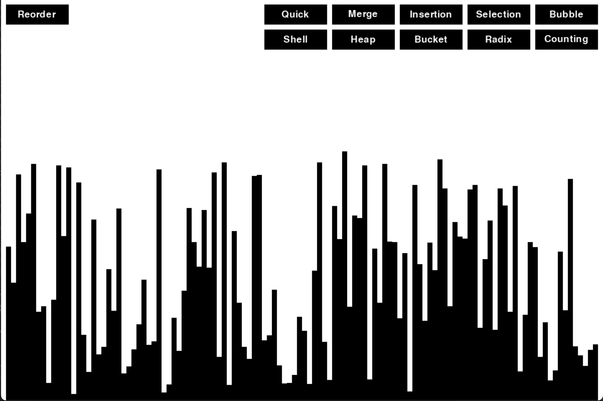

# Visual Sorter - Pygame Visualization

## Overview
The Visual Sorter is a Python application designed to provide an interactive experience for understanding and comparing various sorting algorithms. Utilizing the Pygame library, this project animates the sorting process for several common algorithms, offering a clear and engaging way to visualize their operations and efficiency.

## Features
- **Multiple Sorting Algorithms**: Includes visualizations for Quick, Merge, Insertion, Selection, Bubble, Shell, Heap, Bucket, Radix, and Counting sorts.
- **Educational Tool**: Ideal for students and educators looking to demonstrate and learn about sorting algorithms in a dynamic way.
- **Customizable Settings**: Modify array size and sorting speed to explore different scenarios and algorithm performances.

## Getting Started

### Prerequisites
- Python 3.6+
- Pygame

### Installation
Install Pygame using pip:


```bash
pip install pygame
```

## Showcase

Here's a glimpse of the Visual Sorter in action:



This image showcases the user interface of the application with an array being sorted by one of the implemented algorithms.


